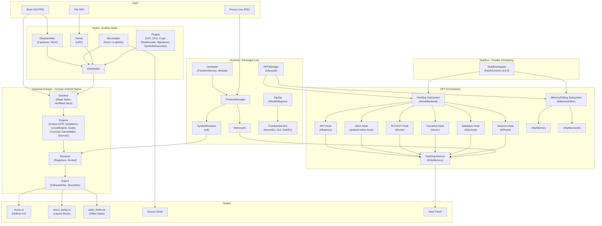
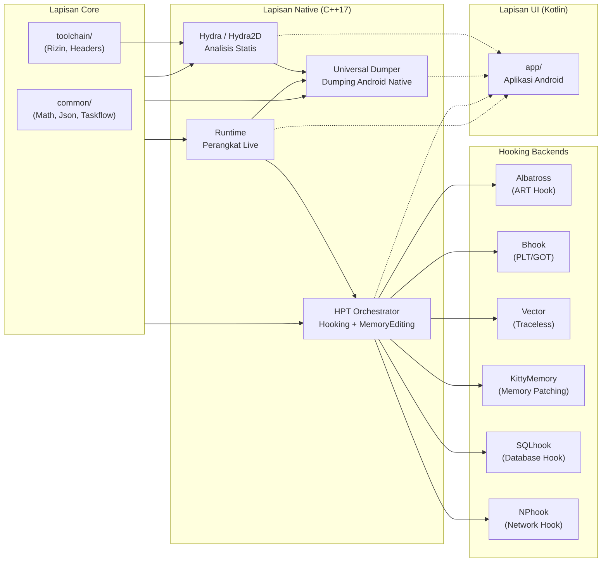

<p align="center">
  
</p>

<h1 align="center">OmniByte</h1>

<p align="center">
  <strong>Toolkit Reverse Engineering Android</strong><br/>
  Dekompilator &bull; Editor &bull; Dumper &bull; Hooking &bull; Editor Memori &bull; Monitoring Jaringan
</p>

<p align="center">
  <strong>🇮🇩 Bahasa Indonesia</strong> &bull;
  <a href="README_EN.md">🇬🇧 English</a> &bull;
  <a href="README_PT.md">🇧🇷 Portugu&ecirc;s</a> &bull;
  <a href="README_RU.md">🇷🇺 Русский</a> &bull;
  <a href="README_ZH.md">🇨🇳 中文</a>
</p>

---

## Tentang

OmniByte adalah toolkit reverse engineering Android berbasis **Kotlin + C++ Native** yang mendukung multi-arsitektur (**ARMv7** & **ARMv8a**) dan multi-versi Android (**6.0 hingga versi terakhir**).

Toolkit ini dirancang untuk analisis statis & dinamis, dekompilasi, editasi biner, hooking fungsi, editasi memori, serta monitoring, penangkapan & editasi jaringan — semua dalam satu platform terpadu. **Tanpa lifting ke LLVM**.

**Fitur Khusus:**
- ✅ **Berjalan dengan root DAN tanpa root** — Mendukung akses root (KernelSU, Magisk, SukiSU) dan mode non-root via `/proc/pid/mem`
- 🔍 **Universal Dumper untuk Android Native Library** — Mendumping semua library `.so` dari proses Android (libil2cpp.so, libtamarin.so, libunity.so, dll.)
- ⚡ **HPT Orchestrator** — Orkestrasi hooking & memory editing melalui Hooking/MemoryEditing subsystems
- 🔄 **Taskflow Adapter** — Adaptasi taskflow untuk scheduling & parallelisasi

## Fitur Utama

| Fitur | Deskripsi |
|-------|-----------|
| 🔍 **APK Decompiler** | Dekompilasi APK ke source code (Java/Smali/DEX) dengan dukungan multi-engine |
| ✏️ **APK Editor** | Penampil & manipulasi manifest, resource, smali, dan rebuild APK |
| 📊 **Analisis Biner** | Analisis statis & dinamis biner (ELF/PE) dengan disassembler & decompiler |
| 🔧 **Editor Biner** | Penampil, ekplorasi & manipulasi biner langsung dengan hex editor & patching |
| 📦 **Universal Dumper** | Dump universal library Android native (semua engine: Unity, Unreal, Godot, dll.) secara manual atau otomatis saat Live PID |
| 🪝 **Hooking** | Hook fungsi native & ART method dengan 6 backend (Albatross, Bhook, Vector, KittyMemory, SQLhook, NPhook) |
| 🧠 **Editor Memori** | Baca & tulis memori proses live via KittyMemory/KittyMemoryEx |
| 🗄️ **Database Hooking** | Hook fungsi database SQLite (sqlite3_exec, sqlite3_prepare_v2, dll.) via SQLhook |
| 🌐 **Network Hooking** | Hook libc network functions (send, recv, connect, socket) via NPhook (dlsym + inline hook) |
| 📡 **Monitoring, Penangkapan & Editasi Jaringan** | Monitor, tangkap, dan edit paket jaringan secara real-time |

## Dukungan Platform

| Komponen | Dukungan |
|----------|----------|
| **Android** | 6.0 (API 23) — versi terakhir |
| **Arsitektur** | ARMv7 (32-bit), ARMv8a (64-bit) |
| **Bahasa** | Kotlin (UI), C++17 (Native Core) |
| **Build System** | Gradle + CMake |
| **STL** | c++_shared |

## Struktur Proyek

```
OmniByte/
├── app/                                 # Aplikasi Android (Kotlin)
│   └── src/main/
│       ├── java/com/omnibyte/           # Source Kotlin
│       ├── cpp/                         # Native aggregator (CMake)
│       └── res/                         # Resource Android
├── Hydra/                               # Mesin Analisis Statis & Dinamis
│   ├── Hydra2D/                         # Mesin analisis inti
│   │   ├── Disassembler/                # Disassembly biner
│   │   ├── Decompiler/                  # Dekompilasi kode
│   │   ├── Parser/                      # Parsing format biner
│   │   ├── Orchestrator/                # Orkestrasi analisis
│   │   ├── Factory/                     # Faktor komponen
│   │   ├── Plugin/                      # Plugin analisis
│   │   │   ├── Enhanced/                # Plugin lanjutan
│   │   │   │   ├── AST/                 # Abstract Syntax Tree
│   │   │   │   ├── CFG/                 # Control Flow Graph
│   │   │   │   ├── Crypt/               # Deteksi kriptografi
│   │   │   │   ├── Deobfuscate/         # Deteksi & penghilang obfuskasi
│   │   │   │   ├── Emulation/           # Emulasi biner
│   │   │   │   ├── FunctionResolver/.   #
│   │   │   │   ├── RTTI/                # Runtime Type Info
│   │   │   │   ├── Signatures/          # Pola tanda tangan
│   │   │   │   └── SymbolicExecution/
│   │   │   └── ScriptHooks/             # Hook berbasis skrip
│   │   └── docs/
│   └── Shared/                           # Metadata bersama
├── modules/
│   ├── Dumper/                           # Modul Universal Dumper
│   │   ├── DumperCore/                   # Logika inti dumper
│   │   │   ├── Detector/                 # Deteksi engine
│   │   │   ├── EngineRegistry/           # Registrasi engine
│   │   │   ├── ResultNormalizer/         # Normalisasi output
│   │   │   ├── SignatureBypass/          # Bypass tanda tangan APK
│   │   │   ├── SharedUtils/              # Utilitas
│   │   │   └── WorkingModes/             # Mode Manual & Live
│   │   ├── Engines/                      # 7 Engine Dumper
│   │   │   ├── UnityIL2CPP/              # Unity IL2CPP
│   │   │   ├── UnityMono/                # Unity Mono
│   │   │   ├── UnrealEngine/             # Unreal Engine
│   │   │   ├── Godot/                    # Godot Engine
│   │   │   ├── Cocos2d/          # Cocos2d
│   │   │   ├── GameMaker/        # GameMaker
│   │   │   └── Source2/          # Source 2
│   │   └── Export/               # Penulis hasil
│   ├── Hooker/                   # Modul Hooking
│   │   ├── HookEngine/           # Teknik hook
│   │   │   ├── ARTHook/          # Hook metode ART
│   │   │   ├── InlineHook/       # Inline hook fungsi
│   │   │   ├── PLT_GOTHook/      # PLT/GOT hook
│   │   │   └── TracelessHook/    # Hook anti-deteksi
│   │   └── backends/             # Backend hook
│   │       ├── Albatross/        # Backend ART hook
│   │       ├── Bhook/            # Backend PLT/GOT
│   │       ├── Inlinehook/       # Backend inline hook
│   │       ├── KittyMemory/      # Manipulasi memori
│   │       ├── KittyMemoryEx/    # Ekstensi manipulasi memori
│   │       └── Vector/           # Backend traceless
│   └── HPT/                      # Modul HPT Orchestrator
│       ├── Hooker/               # Subsystem hooking (IHookBackend)
│       │   ├── Albatross/        # ART method hook (pls/plthook + shadowhook)
│       │   ├── Bhook/            # PLT/GOT hook (PLTHook + shadowhook)
│       │   ├── Inlinehook/       # Inline hook (shadowhook)
│       │   ├── Vectorhook/       # Traceless hook (pltinline)
│       │   ├── SQLhook/          # Database hook (sqlite3 hooking)
│       │   └── NPhook/           # Network packet hook (dlsym + shadowhook)
│       └── MemoryEditor/         # Subsystem memory editing (IMemoryEditor)
├── runtime/                      # Runtime Perangkat Live
│   ├── Bridges/                  # Pemuat jembatan
│   │   ├── FreedomServiceBridge/ # Jembatan layanan root
│   │   └── ModuleBridge/         # Jembatan modul
│   ├── ProcessManager/           # Manajemen proses
│   ├── MemoryIO/                 # Baca/tulis memori
│   ├── SymbolResolver/           # Resolusi simbol (xdl)
│   ├── ZigZag/                   # Mesin stealth/bypass
│   ├── ZigZagManager/            # Manajemen stealth
│   ├── HPTManager/               # Manajemen HPT lifecycle
│   └── FreedomService/           # Layanan akses root
│       ├── KernelSU-Next/        # Dukungan KernelSU
│       ├── SUI/                  # Dukungan Magisk SUI
│       ├── SukiSU-Ultra/         # Dukungan SukiSU
│       └── RootThread/           # Manajemen thread root
├── common/                       # Utilitas bersama
│   ├── Math/                     # Utilitas matematika
│   ├── Json/                     # Serialisasi
│   └── Taskflow/                 # Taskflow adapter (FetchContent v3.8.0)
├── toolchain/                    # Toolchain build
│   ├── rizin-android/            # Disassembler Rizin
│   └── stub-headers/             # Header stub
├── scripts/                      # Skrip build
├── docs/                         # Dokumentasi
└── test/                         # Bahan untuk test
```

## Pipeline Kerja

<details open>
<summary><strong>Pipeline Kerja (klik untuk hide/unhide)</strong></summary>



</details>

## Arsitektur Modul

<details open>
<summary><strong>Arsitektur Modul (klik untuk hide/unhide)</strong></summary>



</details>

## Build

```bash
# Clone
git clone https://github.com/CicakDroid/OmniByte.git
cd OmniByte

# Build APK
./gradlew assembleDebug

# Atau build native only
./scripts/build-native.sh

# Build dengan opsi tertentu
./scripts/build-native.sh --abi arm64-v8a --api 23
./scripts/build-native.sh --abi armeabi-v7a --api 21
./scripts/build-native.sh --clean
```

> **Catatan:** Build native membutuhkan Android SDK & NDK. Jalankan `./scripts/build-native.sh --help` untuk opsi lengkap.

## Lisensi

Proyek ini merupakan bagian dari OmniByte Research Platform.

---

<p align="center">
  <sub>Dibuat dengan ❤️ oleh <a href="https://github.com/CicakDroid">CicakDroid</a></sub>
</p>
