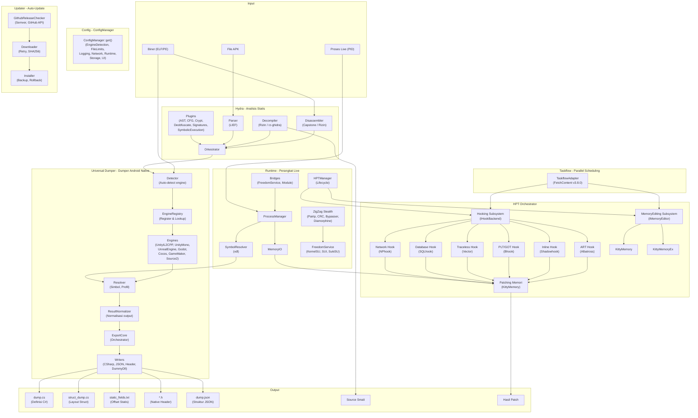
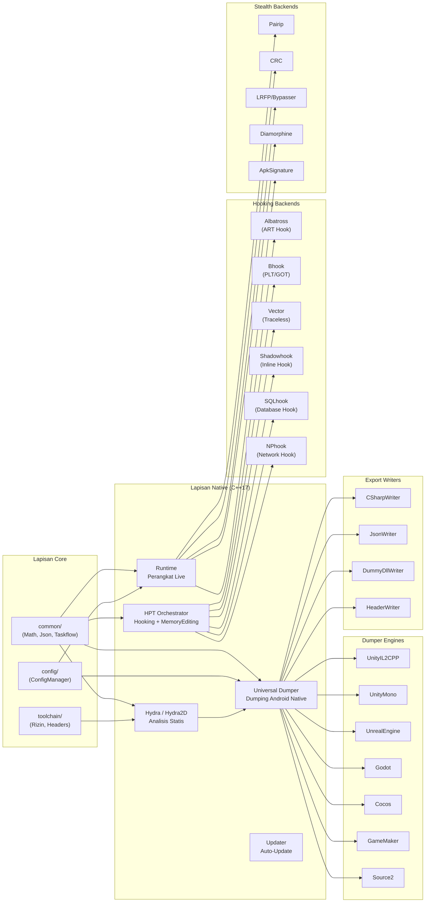

<p align="center">
  
</p>

<h1 align="center">OmniByte</h1>

<p align="center">
  <strong>Toolkit Reverse Engineering Android</strong><br/>
  Dekompilator &bull; Editor &bull; Dumper &bull; Hooking &bull; Editor Memori &bull; Monitoring Jaringan
</p>

<p align="center">
  <strong>🇮🇩 Bahasa Indonesia</strong> &bull;
  <a href="README_EN.md">🇬🇧 English</a> &bull;
  <a href="README_PT.md">🇧🇷 Portugu&ecirc;s</a> &bull;
  <a href="README_RU.md">🇷🇺 Русский</a> &bull;
  <a href="README_ZH.md">🇨🇳 中文</a>
</p>

---

## Tentang

OmniByte adalah toolkit reverse engineering Android berbasis **Kotlin + C++ Native** yang mendukung multi-arsitektur (**ARMv7** & **ARMv8a**) dan multi-versi Android (**6.0 hingga versi terakhir**).

Toolkit ini dirancang untuk analisis statis & dinamis, dekompilasi, editasi biner, hooking fungsi, editasi memori, serta monitoring, penangkapan & editasi jaringan — semua dalam satu platform terpadu. **Tanpa lifting ke LLVM**.

**Fitur Khusus:**
- ✅ **Berjalan dengan root DAN tanpa root** — Mendukung akses root (KernelSU, Magisk, SukiSU) dan mode non-root via `/proc/pid/mem`
- 🔍 **Universal Dumper untuk Android Native Library** — Mendumping semua library `.so` dari proses Android (libil2cpp.so, libtamarin.so, libunity.so, dll.)
- ⚡ **HPT Orchestrator** — Orkestrasi hooking & memory editing melalui Hooking/MemoryEditing subsystems
- 🔄 **Taskflow Adapter** — Adaptasi taskflow untuk scheduling & parallelisasi
- 🛡️ **ZigZag Stealth** — Bypass anti-tamper (Pairip, CRC, LRFP/Bypasser, Diamorphine)
- 📤 **Export Pipeline** — Multi-format output (C#, JSON, Header, DummyDll) via ExportCore orchestrator

## Fitur Utama

| Fitur | Deskripsi |
|-------|-----------|
| 🔍 **APK Decompiler** | Dekompilasi APK ke source code (Java/Smali/DEX) dengan dukungan multi-engine |
| ✏️ **APK Editor** | Penampil & manipulasi manifest, resource, smali, dan rebuild APK |
| 📊 **Analisis Biner** | Analisis statis & dinamis biner (ELF/PE) dengan disassembler & decompiler |
| 🔧 **Editor Biner** | Penampil, ekplorasi & manipulasi biner langsung dengan hex editor & patching |
| 📦 **Universal Dumper** | Dump universal library Android native (7 engine) secara manual atau otomatis saat Live PID |
| 🪝 **Hooking** | Hook fungsi native & ART method dengan 6 backend (Albatross, Bhook, Vector, KittyMemory, SQLhook, NPhook) |
| 🧠 **Editor Memori** | Baca & tulis memori proses live via KittyMemory/KittyMemoryEx |
| 🗄️ **Database Hooking** | Hook fungsi database SQLite via SQLhook |
| 🌐 **Network Hooking** | Hook libc network functions via NPhook (dlsym + inline hook) |
| 📡 **Monitoring Jaringan** | Monitor, tangkap, dan edit paket jaringan secara real-time |
| 🛡️ **ZigZag Stealth** | Bypass anti-tamper & anti-debug (Pairip, CRC, LRFP, Diamorphine) |
| 🔄 **Updater** | Auto-update via GitHub Releases (semver, SHA256, backup/rollback) |

## Dukungan Platform

| Komponen | Dukungan |
|----------|----------|
| **Android** | 6.0 (API 23) — versi terakhir |
| **Arsitektur** | ARMv7 (32-bit), ARMv8a (64-bit) |
| **Bahasa** | Kotlin (UI), C++17 (Native Core) |
| **Build System** | Gradle + CMake |
| **STL** | c++_shared |

## Struktur Proyek

<details open>
<summary><strong>Struktur Direktori (klik untuk hide/unhide)</strong></summary>

```
OmniByte/
├── app/                                    # Aplikasi Android (Kotlin)
│   └── src/main/
│       ├── java/com/omnibyte/app/          # Source Kotlin
│       ├── cpp/                            # Native aggregator (CMake)
│       └── res/                            # Resource Android
│
├── Hydra/                                  # Mesin Analisis Statis & Dinamis
│   ├── Hydra2D/                            # Mesin analisis inti
│   │   ├── Disassembler/backends/          # Capstone adapter
│   │   ├── Decompiler/backends/            # Rizin native, rz-ghidra adapter
│   │   ├── Parser/backends/                # LIEF adapter
│   │   ├── Orchestrator/                   # Orkestrasi analisis
│   │   ├── Factory/                        # Faktor komponen
│   │   ├── Plugin/
│   │   │   ├── Enhanced/                   # Plugin lanjutan
│   │   │   │   ├── AST/                    # Abstract Syntax Tree
│   │   │   │   ├── CFG/                    # Control Flow Graph
│   │   │   │   ├── Crypt/                  # FindCrypt3, DeCrypt3
│   │   │   │   ├── Deobfuscate/            # DexKit, hrtng
│   │   │   │   ├── Emulation/              # Qemu, Unicorn
│   │   │   │   ├── FunctionResolver/       # Resolusi fungsi
│   │   │   │   ├── RTTI/                   # Runtime Type Info
│   │   │   │   ├── Signatures/             # MagicBytes, Pattern, Yara, DB
│   │   │   │   └── SymbolicExecution/      # Triton, Z3, CVC5
│   │   │   └── ScriptHooks/                # Loader + Runner
│   │   └── docs/research-reports/          # Laporan riset plugin
│   └── Shared/Metadata/                    # Metadata bersama (DumpData, entries)
│
├── modules/
│   ├── Dumper/                             # Modul Universal Dumper
│   │   ├── DumperCore/                     # Logika inti dumper
│   │   │   ├── Detector/                   # Deteksi engine otomatis
│   │   │   ├── EngineRegistry/             # Registrasi & lookup engine
│   │   │   ├── ResultNormalizer/           # Normalisasi output engine
│   │   │   ├── SharedUtils/                # Utilitas bersama
│   │   │   └── WorkingModes/               # Mode Manual & Live PID
│   │   ├── Engines/                        # 7 Engine Dumper
│   │   │   ├── UnityIL2CPP/                # Unity IL2CPP (Analyzer, Profiles, Resolver)
│   │   │   ├── UnityMono/                  # Unity Mono (Analyzer, Profiles, Resolver)
│   │   │   ├── UnrealEngine/               # Unreal Engine UE4/UE5 (SignatureBypass, Profiles, Resolver)
│   │   │   ├── Godot/                      # Godot Engine (KeyExtractor, Profiles, Resolver)
│   │   │   ├── Cocos/                      # Cocos2d-x (v2/v3/v4) + Cocos Creator (v1/v2/v3)
│   │   │   ├── GameMaker/                  # GameMaker Studio (Analyzer, Profiles, Resolver)
│   │   │   └── Source2/                    # Valve Source 2 (Analyzer, Profiles, Resolver)
│   │   └── Export/                         # Pipeline ekspor hasil
│   │       ├── ExportCore/                 # Orchestrator ekspor
│   │       │   ├── ExportRegistry/         # Registry writer (registerDefaults)
│   │       │   ├── IExporter/              # Interface IExporter
│   │       │   └── SectionSplitter/        # Pembagi section (namespace, type)
│   │       └── Writers/                    # Writer implementasi (header-only)
│   │           ├── CSharpWriter/           # Output .cs
│   │           ├── JsonWriter/             # Output .json
│   │           ├── DummyDllWriter/         # Output dummy .dll/.so
│   │           └── HeaderWriter/           # Output .h (native header)
│   │
│   ├── HPT/                                # Modul HPT Orchestrator
│   │   ├── Hooker/                         # Subsystem hooking (IHookBackend)
│   │   │   └── HookEngines/
│   │   │       ├── ARTHook/Albatross/      # ART method hook
│   │   │       ├── InlineHook/Shadowhook/  # Inline hook
│   │   │       ├── PLT_GOTHook/Bhook/      # PLT/GOT hook
│   │   │       ├── TracelessHook/Vectorhook/ # Traceless hook
│   │   │       ├── DatabaseHook/SQLhook/   # Database hook (sqlite3)
│   │   │       ├── NPHook/NetworkPackethook/ # Network packet hook
│   │   │       └── IoHook/                 # I/O hook
│   │   └── MemoryEditor/                   # Subsystem memory editing (IMemoryEditor)
│   │       └── KittyMemory/                # KittyMemory backend
│   │
│   └── Hooker/                             # Legacy Hooker module
│       └── HookEngine/                     # ARTHook, InlineHook, PLT_GOTHook, TracelessHook
│
├── runtime/                                # Runtime Perangkat Live
│   ├── Bridges/                            # Pemuat jembatan
│   │   ├── FreedomServiceBridge/           # Jembatan layanan root
│   │   └── ModuleBridge/                   # Jembatan modul
│   ├── ProcessManager/                     # Manajemen proses
│   ├── MemoryIO/                           # Baca/tulis memori (/proc/pid/mem)
│   ├── SymbolResolver/                     # Resolusi simbol
│   │   └── xdl-adapter/                    # Adapter xdl (dlopen/dlsym)
│   ├── ZigZag/                             # Mesin stealth/bypass
│   │   └── backends/
│   │       ├── ApkSignature/               # Bypass tanda tangan APK
│   │       │   ├── ApkSigKiller/
│   │       │   ├── ApkSigKillerEx/
│   │       │   ├── LoadedApkSpoofer/
│   │       │   ├── NativePmsHook/
│   │       │   ├── SignatureExtractor/
│   │       │   └── SignatureInjector/
│   │       ├── CRC/                        # Bypass CRC check
│   │       ├── LRFP/Bypasser/              # Bypass LRFP
│   │       ├── Pairip/                     # Bypass Pairip
│   │       └── Procees/
│   │           └── Diamorphine/            # Anti-debug
│   ├── ZigZagManager/                      # Manajemen stealth lifecycle
│   ├── HPTManager/                         # Manajemen HPT lifecycle
│   └── FreedomService/                     # Layanan akses root
│       ├── KernelSU-Next/                  # Dukungan KernelSU
│       ├── SUI/                            # Dukungan Magisk SUI
│       ├── SukiSU-Ultra/                   # Dukungan SukiSU
│       ├── RootThread/                     # Manajemen thread root
│       └── backends/                       # Backend root detection
│
├── config/                                 # Konfigurasi JSON (ConfigManager)
│   ├── EngineDetection/                    # Threshold deteksi engine
│   ├── FileLimits/                         # Batas ukuran & ekstensi file
│   ├── Logging/                            # Level & format log
│   ├── Network/                            # timeout, retry, user-agent
│   ├── Runtime/                            # backend priority
│   ├── Storage/                            # Path output, backup, auto-cleanup
│   └── UI/                                 # tema, bahasa, notifikasi
│
├── common/                                 # Utilitas bersama
│   ├── Math/GLM/                           # Utilitas matematika
│   ├── Deserialization-Serialization/Json/ # Serialisasi JSON
│   └── Taskflow/                           # Taskflow adapter (FetchContent v3.8.0)
│
├── updater/                                # Sistem auto-update
│   ├── GithubReleaseChecker/               # Cek rilis baru (semver, GitHub API)
│   ├── Downloader/                         # Unduh asset (retry, SHA256)
│   └── Installer/                          # Instal update (backup/rollback)
│
├── toolchain/                              # Toolchain build
│   ├── rizin-android/                      # Disassembler Rizin
│   └── stub-headers/                       # Header stub (cvc5, rizin, triton, z3)
│
├── engine-core/                            # Legacy engine core
│   └── HydraDis/Plugin/Enhanced/Crypt/
│
├── scripts/                                # Skrip build
├── test/                                   # Bahan untuk test
│   └── il2cpp-test/
├── doc/                                    # Dokumentasi
├── docs/                                   # Dokumentasi tambahan
├── gradle/wrapper/                         # Gradle wrapper
└── assets/                                 # Asset proyek (icon, dll.)
```

</details>

## Pipeline Kerja

<details open>
<summary><strong>Pipeline Kerja (klik untuk hide/unhide)</strong></summary>



</details>

## Arsitektur Modul

<details open>
<summary><strong>Arsitektur Modul (klik untuk hide/unhide)</strong></summary>



</details>

## Build & Instalasi

<details>
<summary><strong>Build & Instalasi (klik untuk hide/unhide)</strong></summary>

### Prasyarat
- Android Studio (latest stable)
- Android NDK r29 (`/opt/android-ndk-r29/`)
- CMake 3.22+
- JDK 17+

### Build
```bash
# Clone repository
git clone https://github.com/user/OmniByte.git
cd OmniByte

# Build APK
./gradlew assembleDebug

# NDK syntax check (opsional)
/opt/android-ndk-r29/toolchains/llvm/prebuilt/linux-x86_64/bin/aarch64-linux-android23-clang++   -std=c++17 -fsyntax-only -I<path> <file.cpp>
```

### Konfigurasi
Semua konfigurasi diakses melalui `ConfigManager::get<T>()`. Tidak ada hardcoding file langsung.

```
config/
├── EngineDetection/    # Threshold deteksi engine
├── FileLimits/         # Batas ukuran & ekstensi file
├── Logging/            # Level & format log
├── Network/            # timeout, retry, user-agent
├── Runtime/            # backend priority
├── Storage/            # Path output, backup, auto-cleanup
└── UI/                 # tema, bahasa, notifikasi
```

</details>

## Kontribusi

<details>
<summary><strong>Kontribusi (klik untuk hide/unhide)</strong></summary>

1. Fork repository
2. Buat branch fitur (`git checkout -b feature/amazing-feature`)
3. Commit perubahan (`git commit -m 'Add amazing feature'`)
4. Push ke branch (`git push origin feature/amazing-feature`)
5. Buka Pull Request

### Aturan
- **Komennya penting** — Semua kode butuh proses, dokumentasikan dengan jelas
- **ConfigManager** — Gunakan `ConfigManager::get<T>()` untuk semua akses konfigurasi
- **Multi-threading** — Gunakan `common/Taskflow` untuk parallelisasi
- **Sub-version granularity** — Profil engine harus spesifik (mis. v3.17.2 bukan hanya v3)

</details>

## Lisensi

Proyek ini dilisensikan di bawah MIT License. Lihat file `LICENSE` untuk informasi lebih lanjut.

---

<p align="center">
  <sub>Dibuat dengan ❤️ oleh OmniByte Team</sub>
</p>
