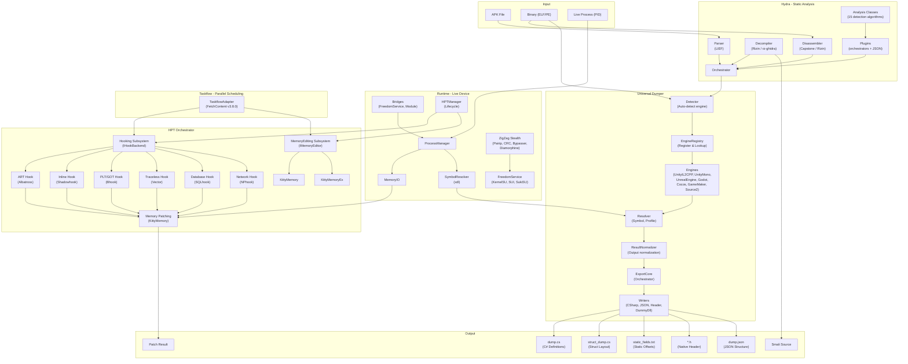
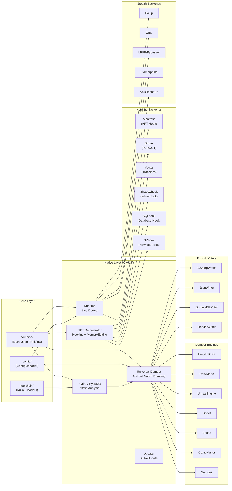

<p align="center">
  
</p>

<h1 align="center">OmniByte</h1>

<p align="center">
  <strong>Ferramenta de Engenharia Reversa para Android</strong><br/>
  Descompilador &bull; Editor &bull; Dumper &bull; Hooking &bull; Editor de Memoria &bull; Monitoramento de Rede
</p>

<p align="center">
  <a href="README.md">🇮🇩 Bahasa Indonesia</a> &bull;
  <a href="README_EN.md">🇬🇧 English</a> &bull;
  <strong>🇧🇷 Portugu&ecirc;s</strong> &bull;
  <a href="README_RU.md">🇷🇺 Русский</a> &bull;
  <a href="README_ZH.md">🇨🇳 中文</a>
</p>

---

## Sobre

OmniByte is an Android reverse engineering toolkit built on **Kotlin + C++ Native**, supporting multi-architecture (**ARMv7** & **ARMv8a**) and multi-version Android (**6.0 to latest**).

Designed for static & dynamic analysis, decompilation, binary editing, function hooking, memory editing, and network monitoring, capturing & editing — all in one unified platform. **No LLVM lifting**.

**Special Features:**
- ✅ **Runs with root AND without root** — Supports root access (KernelSU, Magisk, SukiSU) and non-root mode via `/proc/pid/mem`
- 🔍 **Universal Dumper for Android Native Libraries** — Dumps all `.so` libraries from Android processes (libil2cpp.so, libtamarin.so, libunity.so, etc.)
- ⚡ **HPT Orchestrator** — Orchestrates hooking & memory editing through Hooking/MemoryEditing subsystems
- 🔄 **Taskflow Adapter** — Taskflow adaptation for scheduling & parallelization
- 🛡️ **ZigZag Stealth** — Bypass anti-tamper (Pairip, CRC, LRFP/Bypasser, Diamorphine)
- 📤 **Export Pipeline** — Multi-format output (C#, JSON, Header, DummyDll) via ExportCore orchestrator

## Principais Recursos

| Feature | Description |
|---------|-------------|
| 🔍 **APK Decompiler** | Decompile APK to source code (Java/Smali/DEX) with multi-engine support |
| ✏️ **APK Editor** | View & manipulate manifest, resources, smali, and rebuild APK |
| 📊 **Binary Analysis** | Static & dynamic binary analysis (ELF/PE) with disassembler & decompiler |
| 🔧 **Binary Editor** | View, explore & manipulate binaries directly with hex editor & patching |
| 📦 **Universal Dumper** | Dump Android native libraries (7 engines) manually or automatically during Live PID |
| 🪝 **Hooking** | Hook native functions & ART methods with 6 backends (Albatross, Bhook, Vector, KittyMemory, SQLhook, NPhook) |
| 🧠 **Memory Editor** | Read & write live process memory via KittyMemory/KittyMemoryEx |
| 🗄️ **Database Hooking** | Hook SQLite database functions via SQLhook |
| 🌐 **Network Hooking** | Hook libc network functions via NPhook (dlsym + inline hook) |
| 📡 **Network Monitoring** | Monitor, capture, and edit network packets in real-time |
| 🛡️ **ZigZag Stealth** | Bypass anti-tamper & anti-debug (Pairip, CRC, LRFP, Diamorphine) |
| 🔄 **Updater** | Auto-update via GitHub Releases (semver, SHA256, backup/rollback) |

## Suporte a Plataforma

| Component | Support |
|-----------|---------|
| **Android** | 6.0 (API 23) — latest version |
| **Architecture** | ARMv7 (32-bit), ARMv8a (64-bit) |
| **Languages** | Kotlin (UI), C++17 (Native Core) |
| **Build System** | Gradle + CMake |
| **STL** | c++_shared |

## Project Structure

<details open>
<summary><strong>Directory Structure (click to hide/unhide)</strong></summary>

```
OmniByte/
├── app/                                    # Android Application (Kotlin)
│   └── src/main/
│       ├── java/com/omnibyte/app/          # Kotlin Source
│       ├── cpp/                            # Native aggregator (CMake)
│       └── res/                            # Android Resources
│
├── Hydra/                                  # Static & Dynamic Analysis Engine
│   ├── Hydra2D/                            # Core analysis engine
│   │   ├── Disassembler/backends/          # Capstone adapter
│   │   ├── Decompiler/backends/            # Rizin native, rz-ghidra adapter
│   │   ├── Parser/backends/                # LIEF adapter
│   │   ├── Orchestrator/                   # Analysis orchestration
│   │   ├── Factory/                        # Component factory
│   │   ├── Analysis/                       # Binary analysis algorithms (15 classes)
│   │   │   ├── IAnalysis.h                 # Abstract interface + Result structs
│   │   │   ├── Structure, Stack, List, Tree # Core algorithms (trie, CFG, dominator)
│   │   │   ├── Packers, Obfuscate, Taint   # Detection algorithms
│   │   │   ├── Functions, Variables, Params # Naming algorithms
│   │   │   ├── Types, Confidences, Strings # Type & scoring algorithms
│   │   │   └── Imports, Exports            # Symbol algorithms
│   │   ├── Plugin/
│   │   │   ├── Enhanced/                   # Advanced plugins
│   │   │   │   ├── AST/                    # Abstract Syntax Tree
│   │   │   │   ├── CFG/                    # Control Flow Graph
│   │   │   │   ├── Crypt/                  # FindCrypt3, DeCrypt3
│   │   │   │   ├── Deobfuscate/            # DexKit, hrtng
│   │   │   │   ├── Emulation/              # Qemu, Unicorn
│   │   │   │   ├── Renamer/                # Function renaming
│   │   │   │   ├── RTTI/                   # Runtime Type Info
│   │   │   │   ├── Signatures/             # MagicBytes, Pattern, Yara, DB
│   │   │   │   └── SymbolicExecution/      # Triton, Z3, CVC5
│   │   │   └── ScriptHooks/                # Loader + Runner
│   │   └── docs/research-reports/          # Plugin research reports
│   └── Shared/Metadata/                    # Shared metadata (DumpData, entries)
│
├── modules/
│   ├── Dumper/                             # Universal Dumper Module
│   │   ├── DumperCore/                     # Core dumper logic
│   │   │   ├── Detector/                   # Auto engine detection
│   │   │   ├── EngineRegistry/             # Engine registration & lookup
│   │   │   ├── ResultNormalizer/           # Output normalization
│   │   │   ├── SharedUtils/                # Shared utilities
│   │   │   └── WorkingModes/               # Manual & Live PID modes
│   │   ├── Engines/                        # 7 Dumper Engines
│   │   │   ├── UnityIL2CPP/                # Unity IL2CPP (Analyzer, Profiles, Resolver)
│   │   │   ├── UnityMono/                  # Unity Mono (Analyzer, Profiles, Resolver)
│   │   │   ├── UnrealEngine/               # Unreal Engine UE4/UE5 (SignatureBypass, Profiles, Resolver)
│   │   │   ├── Godot/                      # Godot Engine (KeyExtractor, Profiles, Resolver)
│   │   │   ├── Cocos/                      # Cocos2d-x (v2/v3/v4) + Cocos Creator (v1/v2/v3)
│   │   │   ├── GameMaker/                  # GameMaker Studio (Analyzer, Profiles, Resolver)
│   │   │   └── Source2/                    # Valve Source 2 (Analyzer, Profiles, Resolver)
│   │   └── Export/                         # Result export pipeline
│   │       ├── ExportCore/                 # Export orchestrator
│   │       │   ├── ExportRegistry/         # Writer registry (registerDefaults)
│   │       │   ├── IExporter/              # IExporter interface
│   │       │   └── SectionSplitter/        # Section splitter (namespace, type)
│   │       └── Writers/                    # Writer implementations (header-only)
│   │           ├── CSharpWriter/           # .cs output
│   │           ├── JsonWriter/             # .json output
│   │           ├── DummyDllWriter/         # dummy .dll/.so output
│   │           └── HeaderWriter/           # .h output (native header)
│   │
│   ├── HPT/                                # HPT Orchestrator Module
│   │   ├── Hooker/                         # Hooking subsystem (IHookBackend)
│   │   │   └── HookEngines/
│   │   │       ├── ARTHook/Albatross/      # ART method hook
│   │   │       ├── InlineHook/Shadowhook/  # Inline hook
│   │   │       ├── PLT_GOTHook/Bhook/      # PLT/GOT hook
│   │   │       ├── TracelessHook/Vectorhook/ # Traceless hook
│   │   │       ├── DatabaseHook/SQLhook/   # Database hook (sqlite3)
│   │   │       ├── NPHook/NetworkPackethook/ # Network packet hook
│   │   │       └── IoHook/                 # I/O hook
│   │   └── MemoryEditor/                   # Memory editing subsystem (IMemoryEditor)
│   │       └── KittyMemory/                # KittyMemory backend
│   │
│   └── Hooker/                             # Legacy Hooker module
│       └── HookEngine/                     # ARTHook, InlineHook, PLT_GOTHook, TracelessHook
│
├── runtime/                                # Live Device Runtime
│   ├── Bridges/                            # Bridge loaders
│   │   ├── FreedomServiceBridge/           # Root service bridge
│   │   └── ModuleBridge/                   # Module bridge
│   ├── ProcessManager/                     # Process management
│   ├── MemoryIO/                           # Memory read/write (/proc/pid/mem)
│   ├── SymbolResolver/                     # Symbol resolution
│   │   └── xdl-adapter/                    # xdl adapter (dlopen/dlsym)
│   ├── ZigZag/                             # Stealth/bypass engine
│   │   └── backends/
│   │       ├── ApkSignature/               # APK signature bypass
│   │       │   ├── ApkSigKiller/
│   │       │   ├── ApkSigKillerEx/
│   │       │   ├── LoadedApkSpoofer/
│   │       │   ├── NativePmsHook/
│   │       │   ├── SignatureExtractor/
│   │       │   └── SignatureInjector/
│   │       ├── CRC/                        # CRC check bypass
│   │       ├── LRFP/Bypasser/              # LRFP bypass
│   │       ├── Pairip/                     # Pairip bypass
│   │       └── Procees/
│   │           └── Diamorphine/            # Anti-debug
│   ├── ZigZagManager/                      # Stealth lifecycle management
│   ├── HPTManager/                         # HPT lifecycle management
│   └── FreedomService/                     # Root access service
│       ├── KernelSU-Next/                  # KernelSU support
│       ├── SUI/                            # Magisk SUI support
│       ├── SukiSU-Ultra/                   # SukiSU support
│       ├── RootThread/                     # Root thread management
│       └── backends/                       # Root detection backends
│
├── config/                                 # JSON Configuration (ConfigManager)
│   ├── EngineDetection/                    # Engine detection thresholds
│   ├── FileLimits/                         # File size & extension limits
│   ├── Logging/                            # Log level & format
│   ├── Network/                            # Timeout, retry, user-agent
│   ├── Runtime/                            # Backend priority
│   ├── Storage/                            # Output path, backup, auto-cleanup
│   └── UI/                                 # Theme, language, notifications
│
├── common/                                 # Shared Utilities
│   ├── Math/GLM/                           # Math utilities
│   ├── Deserialization-Serialization/Json/ # JSON serialization
│   └── Taskflow/                           # Taskflow adapter (FetchContent v3.8.0)
│
├── updater/                                # Auto-update System
│   ├── GithubReleaseChecker/               # Check new releases (semver, GitHub API)
│   ├── Downloader/                         # Download assets (retry, SHA256)
│   └── Installer/                          # Install updates (backup/rollback)
│
├── toolchain/                              # Build Toolchain
│   ├── rizin-android/                      # Rizin disassembler
│   └── stub-headers/                       # Stub headers (cvc5, rizin, triton, z3)
│
├── engine-core/                            # Legacy engine core
│   └── HydraDis/Plugin/Enhanced/Crypt/
│
├── scripts/                                # Build scripts
├── test/                                   # Test materials
│   └── il2cpp-test/
├── doc/                                    # Documentation
├── docs/                                   # Additional documentation
├── gradle/wrapper/                         # Gradle wrapper
└── assets/                                 # Project assets (icon, etc.)
```

</details>

## Workflow Pipeline

<details open>
<summary><strong>Workflow Pipeline (click to hide/unhide)</strong></summary>



</details>

## Module Architecture

<details open>
<summary><strong>Module Architecture (click to hide/unhide)</strong></summary>



</details>

## Build & Installation

<details>
<summary><strong>Build & Installation (click to hide/unhide)</strong></summary>

### Prerequisites
- Android Studio (latest stable)
- Android NDK r29
- CMake 3.22+
- JDK 17+

### Build
```bash
git clone https://github.com/user/OmniByte.git
cd OmniByte
./gradlew assembleDebug
```

### Configuration
All configuration accessed via `ConfigManager::get<T>()`. No direct file hardcoding.

</details>

## Contributing

<details>
<summary><strong>Contributing (click to hide/unhide)</strong></summary>

1. Fork the repository
2. Create a feature branch (`git checkout -b feature/amazing-feature`)
3. Commit changes (`git commit -m 'Add amazing feature'`)
4. Push to branch (`git push origin feature/amazing-feature`)
5. Open a Pull Request

### Rules
- **Comments matter** - All code needs process, document clearly
- **ConfigManager** - Use `ConfigManager::get<T>()` for all config access
- **Multi-threading** - Use `common/Taskflow` for parallelization
- **Sub-version granularity** - Engine profiles must be specific (e.g., v3.17.2 not just v3)

</details>

## License

This project is licensed under the MIT License.

---
