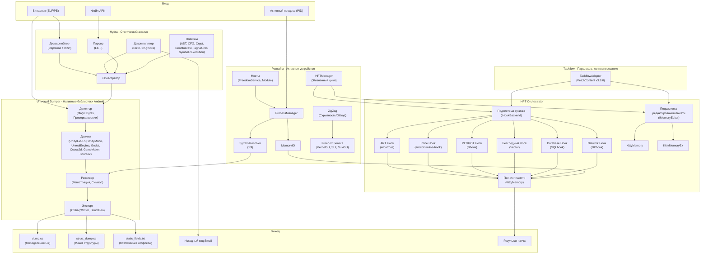
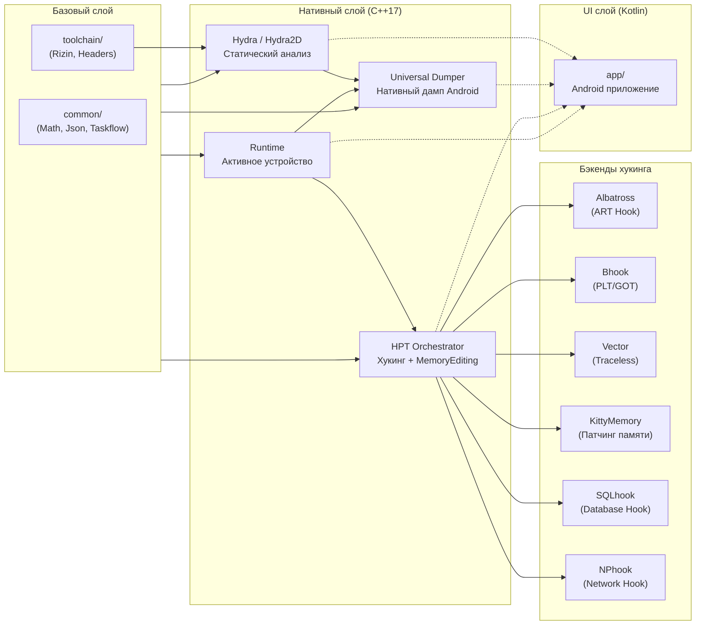

<p align="center">
  
</p>

<h1 align="center">OmniByte</h1>

<p align="center">
  <strong>Инструментарий обратного инженеринга Android</strong><br/>
  Декомпилятор &bull; Редактор &bull; Дампер &bull; Хукинг &bull; Редактор памяти &bull; Мониторинг сети
</p>

<p align="center">
  <a href="README.md">🇮🇩 Bahasa Indonesia</a> &bull;
  <a href="README_EN.md">🇬🇧 English</a> &bull;
  <a href="README_PT.md">🇧🇷 Portugu&ecirc;s</a> &bull;
  <strong>🇷🇺 Русский</strong> &bull;
  <a href="README_ZH.md">🇨🇳 中文</a>
</p>

---

## О проекте

OmniByte — это инструментарий обратного инженеринга Android, построенный на **Kotlin + C++ Native**, с поддержкой мульти-архитектуры (**ARMv7** & **ARMv8a**) и мульти-версий Android (**от 6.0 до последней версии**).

Инструментарий предназначен для статического и динамического анализа, декомпиляции, редактирования бинарников, хукинга функций, редактирования памяти, а также мониторинга, захвата и редактирования сети — всё в одной интегрированной платформе. **Без поднятия до LLVM**.

**Особые возможности:**
- ✅ **Работает с root И без root** — Поддерживает root-доступ (KernelSU, Magisk, SukiSU) и безroot-режим через `/proc/pid/mem`
- 🔍 **Universal Dumper для Android Native Library** — Дамп всех библиотек `.so` из процессов Android (libil2cpp.so, libtamarin.so, libunity.so и т.д.)
- ⚡ **HPT Orchestrator** — Оркестрация хукинга и редактирования памяти через подсистемы Hooking/MemoryEditing
- 🔄 **Taskflow Adapter** — Адаптация taskflow для планирования и параллелизации

## Основные возможности

| Возможность | Описание |
|-------------|----------|
| 🔍 **APK Decompiler** | Декомпиляция APK в исходный код (Java/Smali/DEX) с поддержкой нескольких движков |
| ✏️ **APK Editor** | Редактирование манифеста, ресурсов, smali и пересборка APK |
| 📊 **Анализ бинарников** | Статический анализ бинарников (ELF/PE) с дизассемблером и декомпилятором |
| 🔧 **Редактор бинарников** | Прямое редактирование бинарников с hex-редактором и патчингом |
| 📦 **Universal Dumper** | Дамп универсальных нативных библиотек Android (все движки: Unity, Unreal, Godot и т.д.) вручную или автоматически во время Live PID |
| 🪝 **Хукинг** | Хук нативных функций и методов ART с 6 бэкендами (Albatross, Bhook, Vector, KittyMemory, SQLhook, NPhook) |
| 🧠 **Редактор памяти** | Чтение и запись памяти активных процессов через KittyMemory/KittyMemoryEx |
| 🗄️ **Database Hooking** | Хук функций SQLite (sqlite3_exec, sqlite3_prepare_v2 и т.д.) через SQLhook |
| 🌐 **Network Hooking** | Хук сетевых функций libc (send, recv, connect, socket) через NPhook (dlsym + inline hook) |
| 📡 **Мониторинг, захват и редактирование сети** | Мониторинг, захват и редактирование сетевых пакетов в реальном времени |

## Поддержка платформы

| Компонент | Поддержка |
|-----------|-----------|
| **Android** | 6.0 (API 23) — последняя версия |
| **Архитектура** | ARMv7 (32 бита), ARMv8a (64 бита) |
| **Языки** | Kotlin (UI), C++17 (нативное ядро) |
| **Система сборки** | Gradle + CMake |
| **STL** | c++_shared |

## Структура проекта

```
OmniByte/
├── app/                          # Android приложение (Kotlin)
│   └── src/main/
│       ├── java/com/omnibyte/    # Исходный код Kotlin
│       ├── cpp/                  # Нативный агрегатор (CMake)
│       └── res/                  # Ресурсы Android
├── Hydra/                        # Движок статического анализа
│   ├── Hydra2D/                  # Основной движок анализа
│   │   ├── Disassembler/         # Дизассемблирование бинарников
│   │   ├── Decompiler/           # Декомпиляция кода
│   │   ├── Parser/               # Парсинг форматов бинарников
│   │   ├── Orchestrator/         # Оркестрация анализа
│   │   ├── Factory/              # Фабрика компонентов
│   │   ├── Plugin/               # Плагины анализа
│   │   │   ├── Enhanced/         # Расширенные плагины
│   │   │   │   ├── AST/          # Абстрактное синтаксическое дерево
│   │   │   │   ├── CFG/          # Граф потока управления
│   │   │   │   ├── Crypt/        # Обнаружение криптографии
│   │   │   │   ├── Deobfuscate/  # Деобфускация
│   │   │   │   ├── Emulation/    # Эмуляция бинарников
│   │   │   │   ├── FunctionResolver/
│   │   │   │   ├── RTTI/         # Информация о типах времени выполнения
│   │   │   │   ├── Signatures/   # Паттерн-подписи
│   │   │   │   └── SymbolicExecution/
│   │   │   └── ScriptHooks/      # Скриптовые хуки
│   │   └── docs/
│   └── Shared/                   # Общие метаданные
├── modules/
│   ├── Dumper/                   # Модуль Universal Dumper
│   │   ├── DumperCore/           # Основная логика дампера
│   │   │   ├── Detector/         # Обнаружение движка
│   │   │   ├── EngineRegistry/   # Регистрация движков
│   │   │   ├── ResultNormalizer/ # Нормализация вывода
│   │   │   ├── SignatureBypass/  # Обход подписи APK
│   │   │   ├── SharedUtils/      # Утилиты
│   │   │   └── WorkingModes/     # Ручной и Live режимы
│   │   ├── Engines/              # 7 движков дампера
│   │   │   ├── UnityIL2CPP/      # Unity IL2CPP
│   │   │   ├── UnityMono/        # Unity Mono
│   │   │   ├── UnrealEngine/     # Unreal Engine
│   │   │   ├── Godot/            # Godot Engine
│   │   │   ├── Cocos2d/          # Cocos2d
│   │   │   ├── GameMaker/        # GameMaker
│   │   │   └── Source2/          # Source 2
│   │   └── Export/               # Экспортные модули
│   ├── Hooker/                   # Модуль хукинга
│   │   ├── HookEngine/           # Техники хукинга
│   │   │   ├── ARTHook/          # Хук методов ART
│   │   │   ├── InlineHook/       # Инлайн-хук функций
│   │   │   ├── PLT_GOTHook/      # PLT/GOT хук
│   │   │   └── TracelessHook/    # Безследный хук
│   │   └── backends/             # Бэкенды хукинга
│   │       ├── Albatross/        # Бэкенд ART хука
│   │       ├── Bhook/            # Бэкенд PLT/GOT
│   │       ├── Inlinehook/       # Бэкенд инлайн-хука
│   │       ├── KittyMemory/      # Патчинг памяти
│   │       ├── KittyMemoryEx/    # Расширенная память
│   │       └── Vector/           # Безследный бэкенд
│   └── HPT/                      # Модуль HPT Orchestrator
│       ├── Hooker/               # Подсистема хукинга (IHookBackend)
│       │   ├── Albatross/        # ART method hook (pls/plthook + shadowhook)
│       │   ├── Bhook/            # PLT/GOT hook (PLTHook + shadowhook)
│       │   ├── Inlinehook/       # Inline hook (shadowhook)
│       │   ├── Vectorhook/       # Traceless hook (pltinline)
│       │   ├── SQLhook/          # Database hook (sqlite3 hooking)
│       │   └── NPhook/           # Network packet hook (dlsym + shadowhook)
│       └── MemoryEditor/         # Подсистема редактирования памяти (IMemoryEditor)
├── runtime/                      # Рантайм активного устройства
│   ├── Bridges/                  # Загрузчики мостов
│   │   ├── FreedomServiceBridge/ # Мост сервиса root
│   │   └── ModuleBridge/         # Мост модуля
│   ├── ProcessManager/           # Управление процессами
│   ├── MemoryIO/                 # Чтение/запись памяти
│   ├── SymbolResolver/           # Разрешение символов (xdl)
│   ├── ZigZag/                   # Движок скрытности/обхода
│   ├── ZigZagManager/            # Управление скрытностью
│   ├── HPTManager/               # Управление жизненным циклом HPT
│   └── FreedomService/           # Сервис root-доступа
│       ├── KernelSU-Next/        # Поддержка KernelSU
│       ├── SUI/                  # Поддержка Magisk SUI
│       ├── SukiSU-Ultra/         # Поддержка SukiSU
│       └── RootThread/           # Управление потоком root
├── common/                       # Общие утилиты
│   ├── Math/                     # Математические утилиты
│   ├── Json/                     # Сериализация
│   └── Taskflow/                 # Адаптер Taskflow (FetchContent v3.8.0)
├── toolchain/                    # Инструментальная цепочка
│   ├── rizin-android/            # Дизассемблер Rizin
│   └── stub-headers/             # Заглушки заголовков
├── scripts/                      # Скрипты сборки
├── docs/                         # Документация
└── test/                         # Тестовые фикстуры
```

## Рабочий пайплайн

<details open>
<summary><strong>Рабочий пайплайн (нажмите чтобы скрыть/показать)</strong></summary>



</details>

## Архитектура модулей

<details open>
<summary><strong>Архитектура модулей (нажмите чтобы скрыть/показать)</strong></summary>



</details>

## Сборка

```bash
# Клонировать
git clone https://github.com/CicakDroid/OmniByte.git
cd OmniByte

# Сборка APK
./gradlew assembleDebug

# Или сборка только нативного кода
./scripts/build-native.sh

# Сборка с определёнными опциями
./scripts/build-native.sh --abi arm64-v8a --api 23
./scripts/build-native.sh --abi armeabi-v7a --api 21
./scripts/build-native.sh --clean
```

> **Примечание:** Нативная сборка требует Android SDK и NDK. Запустите `./scripts/build-native.sh --help` для всех опций.

## Лицензия

Этот проект является частью OmniByte Research Platform.

---

<p align="center">
  <sub>Создано с ❤️ от <a href="https://github.com/CicakDroid">CicakDroid</a></sub>
</p>
