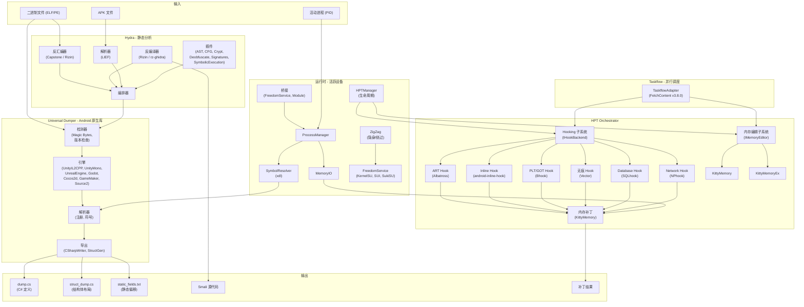
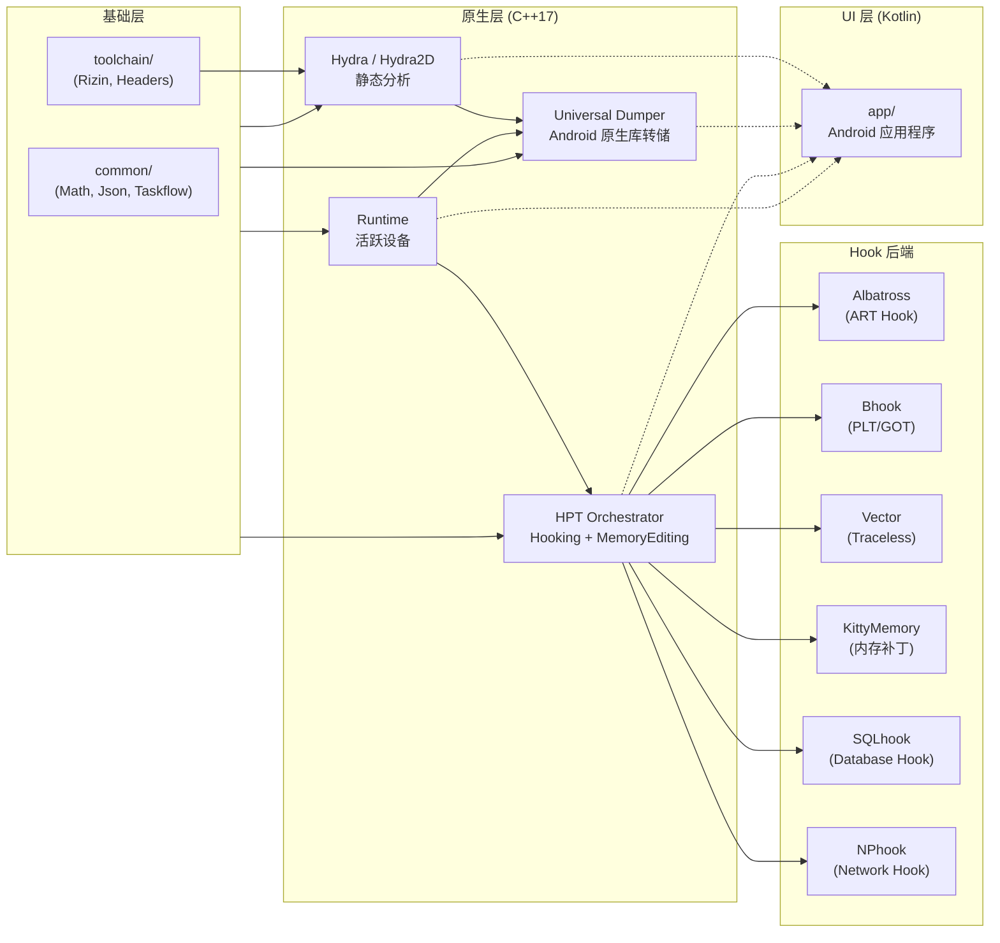

<p align="center">
  
</p>

<h1 align="center">OmniByte</h1>

<p align="center">
  <strong>Android 逆向工程工具包</strong><br/>
  反编译器 &bull; 编辑器 &bull; Dumper &bull; Hooking &bull; 内存编辑器 &bull; 网络监控
</p>

<p align="center">
  <a href="README.md">🇮🇩 Bahasa Indonesia</a> &bull;
  <a href="README_EN.md">🇬🇧 English</a> &bull;
  <a href="README_PT.md">🇧🇷 Portugu&ecirc;s</a> &bull;
  <a href="README_RU.md">🇷🇺 Русский</a> &bull;
  <strong>🇨🇳 中文</strong>
</p>

---

## 关于

OmniByte 是一个基于 **Kotlin + C++ Native** 构建的 Android 逆向工程工具包，支持多架构（**ARMv7** & **ARMv8a**）和多版本 Android（**6.0 到最新版本**）。

该工具包专为静态和动态分析、反编译、二进制编辑、函数 Hooking、内存编辑以及网络监控、捕获与编辑而设计 — 全部集成在一个统一平台中。**无需提升至 LLVM**。

**特殊功能：**
- ✅ **支持 root 和非 root 运行** — 支持 root 访问（KernelSU, Magisk, SukiSU）和通过 `/proc/pid/mem` 的非 root 模式
- 🔍 **Universal Dumper for Android Native Library** — 转储 Android 进程的所有 `.so` 库（libil2cpp.so, libtamarin.so, libunity.so 等）
- ⚡ **HPT Orchestrator** — 通过 Hooking/MemoryEditing 子系统编排 hooking & 内存编辑
- 🔄 **Taskflow Adapter** — 适配 taskflow 用于调度和并行化

## 主要功能

| 功能 | 描述 |
|------|------|
| 🔍 **APK 反编译器** | 将 APK 反编译为源代码（Java/Smali/DEX），支持多引擎 |
| ✏️ **APK 编辑器** | 编辑清单、资源、smali 并重新构建 APK |
| 📊 **二进制分析** | 静态二进制分析（ELF/PE），包含反汇编器和反编译器 |
| 🔧 **二进制编辑器** | 直接编辑二进制文件，支持十六进制编辑器和补丁 |
| 📦 **Universal Dumper** | 转储 Android 通用原生库（所有引擎：Unity, Unreal, Godot 等），支持手动或 Live PID 自动转储 |
| 🪝 **Hooking** | 使用 6 种后端（Albatross, Bhook, Vector, KittyMemory, SQLhook, NPhook）Hook 原生函数和 ART 方法 |
| 🧠 **内存编辑器** | 通过 KittyMemory/KittyMemoryEx 读写活动进程内存 |
| 🗄️ **Database Hooking** | Hook SQLite 数据库函数（sqlite3_exec, sqlite3_prepare_v2 等）via SQLhook |
| 🌐 **Network Hooking** | Hook libc 网络函数（send, recv, connect, socket）via NPhook（dlsym + inline hook） |
| 📡 **网络监控、捕获与编辑** | 实时监控、捕获和编辑网络数据包 |

## 平台支持

| 组件 | 支持 |
|------|------|
| **Android** | 6.0 (API 23) — 最新版本 |
| **架构** | ARMv7（32位），ARMv8a（64位） |
| **语言** | Kotlin（UI），C++17（原生核心） |
| **构建系统** | Gradle + CMake |
| **STL** | c++_shared |

## 项目结构

```
OmniByte/
├── app/                          # Android 应用程序 (Kotlin)
│   └── src/main/
│       ├── java/com/omnibyte/    # Kotlin 源代码
│       ├── cpp/                  # 原生聚合器 (CMake)
│       └── res/                  # Android 资源
├── Hydra/                        # 静态分析引擎
│   ├── Hydra2D/                  # 核心分析引擎
│   │   ├── Disassembler/         # 二进制反汇编
│   │   ├── Decompiler/           # 代码反编译
│   │   ├── Parser/               # 二进制格式解析
│   │   ├── Orchestrator/         # 分析编排
│   │   ├── Factory/              # 组件工厂
│   │   ├── Plugin/               # 分析插件
│   │   │   ├── Enhanced/         # 高级插件
│   │   │   │   ├── AST/          # 抽象语法树
│   │   │   │   ├── CFG/          # 控制流图
│   │   │   │   ├── Crypt/        # 加密检测
│   │   │   │   ├── Deobfuscate/  # 反混淆
│   │   │   │   ├── Emulation/    # 二进制模拟
│   │   │   │   ├── FunctionResolver/
│   │   │   │   ├── RTTI/         # 运行时类型信息
│   │   │   │   ├── Signatures/   # 模式签名
│   │   │   │   └── SymbolicExecution/
│   │   │   └── ScriptHooks/      # 脚本 Hook
│   │   └── docs/
│   └── Shared/                   # 共享元数据
├── modules/
│   ├── Dumper/                   # Universal Dumper 模块
│   │   ├── DumperCore/           # 核心 dumper 逻辑
│   │   │   ├── Detector/         # 引擎检测
│   │   │   ├── EngineRegistry/   # 引擎注册
│   │   │   ├── ResultNormalizer/ # 输出规范化
│   │   │   ├── SignatureBypass/  # APK 签名绕过
│   │   │   ├── SharedUtils/      # 工具类
│   │   │   └── WorkingModes/     # 手动 & Live 模式
│   │   ├── Engines/              # 7 个 Dumper 引擎
│   │   │   ├── UnityIL2CPP/      # Unity IL2CPP
│   │   │   ├── UnityMono/        # Unity Mono
│   │   │   ├── UnrealEngine/     # Unreal Engine
│   │   │   ├── Godot/            # Godot Engine
│   │   │   ├── Cocos2d/          # Cocos2d
│   │   │   ├── GameMaker/        # GameMaker
│   │   │   └── Source2/          # Source 2
│   │   └── Export/               # 输出写入器
│   ├── Hooker/                   # 函数 Hooking 模块
│   │   ├── HookEngine/           # Hook 技术
│   │   │   ├── ARTHook/          # ART 方法 Hook
│   │   │   ├── InlineHook/       # 内联函数 Hook
│   │   │   ├── PLT_GOTHook/      # PLT/GOT Hook
│   │   │   └── TracelessHook/    # 反检测 Hook
│   │   └── backends/             # Hook 后端
│   │       ├── Albatross/        # ART Hook 后端
│   │       ├── Bhook/            # PLT/GOT 后端
│   │       ├── Inlinehook/       # 内联 Hook 后端
│   │       ├── KittyMemory/      # 内存补丁
│   │       ├── KittyMemoryEx/    # 扩展内存
│   │       └── Vector/           # 无痕后端
│   └── HPT/                      # HPT Orchestrator 模块
│       ├── Hooker/               # Hooking 子系统 (IHookBackend)
│       │   ├── Albatross/        # ART method hook (pls/plthook + shadowhook)
│       │   ├── Bhook/            # PLT/GOT hook (PLTHook + shadowhook)
│       │   ├── Inlinehook/       # Inline hook (shadowhook)
│       │   ├── Vectorhook/       # Traceless hook (pltinline)
│       │   ├── SQLhook/          # Database hook (sqlite3 hooking)
│       │   └── NPhook/           # Network packet hook (dlsym + shadowhook)
│       └── MemoryEditor/         # 内存编辑子系统 (IMemoryEditor)
├── runtime/                      # 活跃设备运行时
│   ├── Bridges/                  # 桥接加载器
│   │   ├── FreedomServiceBridge/ # Root 服务桥接
│   │   └── ModuleBridge/         # 模块桥接
│   ├── ProcessManager/           # 进程管理
│   ├── MemoryIO/                 # 内存读写
│   ├── SymbolResolver/           # 符号解析 (xdl)
│   ├── ZigZag/                   # 隐身/绕过引擎
│   ├── ZigZagManager/            # 隐身管理
│   ├── HPTManager/               # HPT 生命周期管理
│   └── FreedomService/           # Root 访问服务
│       ├── KernelSU-Next/        # KernelSU 支持
│       ├── SUI/                  # Magisk SUI 支持
│       ├── SukiSU-Ultra/         # SukiSU 支持
│       └── RootThread/           # Root 线程管理
├── common/                       # 共享工具类
│   ├── Math/                     # 数学工具
│   ├── Json/                     # 序列化
│   └── Taskflow/                 # Taskflow 适配器 (FetchContent v3.8.0)
├── toolchain/                    # 构建工具链
│   ├── rizin-android/            # Rizin 反汇编器
│   └── stub-headers/             # 桩头文件
├── scripts/                      # 构建脚本
├── docs/                         # 文档
└── test/                         # 测试数据
```

## 工作流程

<details open>
<summary><strong>工作流程（点击隐藏/显示）</strong></summary>



</details>

## 模块架构

<details open>
<summary><strong>模块架构（点击隐藏/显示）</strong></summary>



</details>

## 构建

```bash
# 克隆
git clone https://github.com/CicakDroid/OmniByte.git
cd OmniByte

# 构建 APK
./gradlew assembleDebug

# 或仅构建原生代码
./scripts/build-native.sh

# 使用特定选项构建
./scripts/build-native.sh --abi arm64-v8a --api 23
./scripts/build-native.sh --abi armeabi-v7a --api 21
./scripts/build-native.sh --clean
```

> **注意：** 原生构建需要 Android SDK 和 NDK。运行 `./scripts/build-native.sh --help` 查看所有选项。

## 许可证

本项目是 OmniByte Research Platform 的一部分。

---

<p align="center">
  <sub>由 <a href="https://github.com/CicakDroid">CicakDroid</a> 用 ❤️ 构建</sub>
</p>
