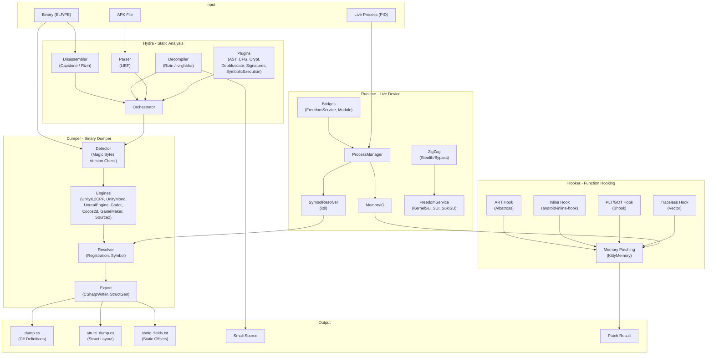
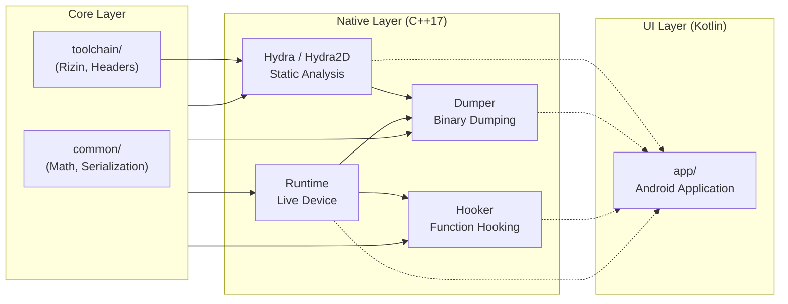

<p align="center">
  
</p>

<h1 align="center">OmniByte</h1>

<p align="center">
  <strong>Android Reverse Engineering Toolkit</strong><br/>
  Decompiler &bull; Editor &bull; Dumper &bull; Hooking &bull; Memory Editor &bull; Network Monitor
</p>

<p align="center">
  <a href="README.md">🇮🇩 Bahasa Indonesia</a> &bull;
  <strong>🇬🇧 English</strong> &bull;
  <a href="README_PT.md">🇧🇷 Portugu&ecirc;s</a> &bull;
  <a href="README_RU.md">🇷🇺 Русский</a> &bull;
  <a href="README_ZH.md">🇨🇳 中文</a>
</p>

---

## About

OmniByte is an Android reverse engineering toolkit built on **Kotlin + C++ Native**, supporting multi-architecture (**ARMv7** & **ARMv8a**) and multi-version Android (**6.0 to the latest release**).

The toolkit is designed for static & dynamic analysis, decompilation, binary editing, function hooking, memory editing, and network packet monitoring & editing — all in a single integrated platform.

## Key Features

| Feature | Description |
|---------|-------------|
| 🔍 **APK Decompiler** | Decompile APK to source code (Java/Smali/DEX) with multi-engine support |
| ✏️ **APK Editor** | Edit manifest, resources, smali, and rebuild APK |
| 📊 **Binary Analysis** | Static binary analysis (ELF/PE) with disassembler & decompiler |
| 🔧 **Binary Editor** | Direct binary editing with hex editor & patching |
| 📦 **Binary Dumper** | Dump binary structure manually or automatically during Live PID |
| 🪝 **Hooking** | Hook native functions & ART methods with 4 different techniques |
| 🧠 **Memory Editor** | Read & write live process memory |
| 🌐 **Network Packet Monitor** | Real-time network traffic monitoring |
| 📝 **Network Packet Editor** | Intercept & edit network packets in real-time |

## Platform Support

| Component | Support |
|-----------|---------|
| **Android** | 6.0 (API 23) — Latest |
| **Architecture** | ARMv7 (32-bit), ARMv8a (64-bit) |
| **Languages** | Kotlin (UI), C++17 (Native Core) |
| **Build System** | Gradle + CMake |
| **STL** | c++_shared |

## Project Structure

```
OmniByte/
├── app/                          # Android Application (Kotlin)
│   └── src/main/
│       ├── java/com/omnibyte/    # Kotlin source
│       ├── cpp/                  # Native aggregator (CMake)
│       └── res/                  # Android resources
├── Hydra/                        # Static Analysis Engine
│   ├── Hydra2D/                  # Core analysis engine
│   │   ├── Disassembler/         # Binary disassembly
│   │   ├── Decompiler/           # Code decompilation
│   │   ├── Parser/               # Binary format parsing
│   │   ├── Orchestrator/         # Analysis orchestration
│   │   ├── Factory/              # Component factory
│   │   ├── Plugin/               # Analysis plugins
│   │   │   ├── Enhanced/         # Advanced plugins
│   │   │   │   ├── AST/          # Abstract Syntax Tree
│   │   │   │   ├── CFG/          # Control Flow Graph
│   │   │   │   ├── Crypt/        # Crypto detection
│   │   │   │   ├── Deobfuscate/  # Deobfuscation
│   │   │   │   ├── Emulation/    # Binary emulation
│   │   │   │   ├── FunctionResolver/
│   │   │   │   ├── RTTI/         # Runtime Type Info
│   │   │   │   ├── Signatures/   # Pattern signatures
│   │   │   │   └── SymbolicExecution/
│   │   │   └── ScriptHooks/      # Script-based hooks
│   │   └── docs/
│   └── Shared/                   # Shared metadata
├── modules/
│   ├── Dumper/                   # Binary Dumper Module
│   │   ├── DumperCore/           # Core dumper logic
│   │   │   ├── Detector/         # Engine detection
│   │   │   ├── EngineRegistry/   # Engine registration
│   │   │   ├── ResultNormalizer/ # Output normalization
│   │   │   ├── SignatureBypass/  # APK signature bypass
│   │   │   ├── SharedUtils/      # Utilities
│   │   │   └── WorkingModes/     # Manual & Live modes
│   │   ├── Engines/              # 7 Dumper Engines
│   │   │   ├── UnityIL2CPP/      # Unity IL2CPP
│   │   │   ├── UnityMono/        # Unity Mono
│   │   │   ├── UnrealEngine/     # Unreal Engine
│   │   │   ├── Godot/            # Godot Engine
│   │   │   ├── Cocos2d/          # Cocos2d
│   │   │   ├── GameMaker/        # GameMaker
│   │   │   └── Source2/          # Source 2
│   │   └── Export/               # Output writers
│   ├── Hooker/                   # Function Hooking Module
│   │   ├── HookEngine/           # Hook techniques
│   │   │   ├── ARTHook/          # ART method hooking
│   │   │   ├── InlineHook/       # Inline function hooking
│   │   │   ├── PLT_GOTHook/      # PLT/GOT hooking
│   │   │   └── TracelessHook/    # Anti-detection hooking
│   │   └── backends/             # Hook backends
│   │       ├── Albatross/        # ART hook backend
│   │       ├── Bhook/            # PLT/GOT backend
│   │       ├── Inlinehook/       # Inline hook backend
│   │       ├── KittyMemory/      # Memory patching
│   │       ├── KittyMemoryEx/    # Extended memory
│   │       └── Vector/           # Traceless backend
│   └── HPT/                      # HPT Module
│       ├── Hooker/               # Hook wrapper
│       └── MemoryEditor/         # Memory editor
├── runtime/                      # Live Device Runtime
│   ├── Bridges/                  # Bridge loaders
│   │   ├── FreedomServiceBridge/ # Root service bridge
│   │   └── ModuleBridge/         # Module bridge
│   ├── ProcessManager/           # Process management
│   ├── MemoryIO/                 # Memory read/write
│   ├── SymbolResolver/           # Symbol resolution (xdl)
│   ├── ZigZag/                   # Stealth/bypass engine
│   ├── ZigZagManager/            # Stealth management
│   └── FreedomService/           # Root access service
│       ├── KernelSU-Next/        # KernelSU support
│       ├── SUI/                  # Magisk SUI support
│       ├── SukiSU-Ultra/         # SukiSU support
│       └── RootThread/           # Root thread management
├── common/                       # Shared utilities
│   ├── Math/                     # Math utilities
│   └── Serialization/            # Serialization
├── toolchain/                    # Build toolchain
│   ├── rizin-android/            # Rizin disassembler
│   └── stub-headers/             # Stub headers
├── scripts/                      # Build scripts
├── docs/                         # Documentation
└── test/                         # Test fixtures
```

## Working Pipeline



## Module Architecture



## Build

```bash
# Clone
git clone https://github.com/CicakDroid/OmniByte.git
cd OmniByte

# Build APK
./gradlew assembleDebug

# Or build native only
cd app/src/main/cpp
mkdir build && cd build
cmake -DCMAKE_TOOLCHAIN_FILE=$ANDROID_NDK/build/cmake/android.toolchain.cmake \
      -DANDROID_ABI=arm64-v8a \
      -DANDROID_PLATFORM=android-23 \
      ..
make
```

## License

This project is part of the OmniByte Research Platform.

---

<p align="center">
  <sub>Built with ❤️ by <a href="https://github.com/CicakDroid">CicakDroid</a></sub>
</p>
