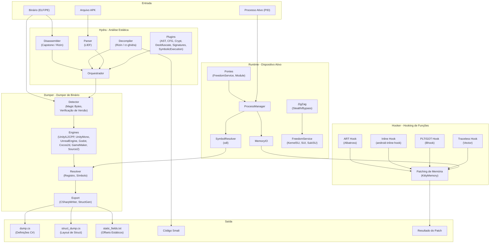
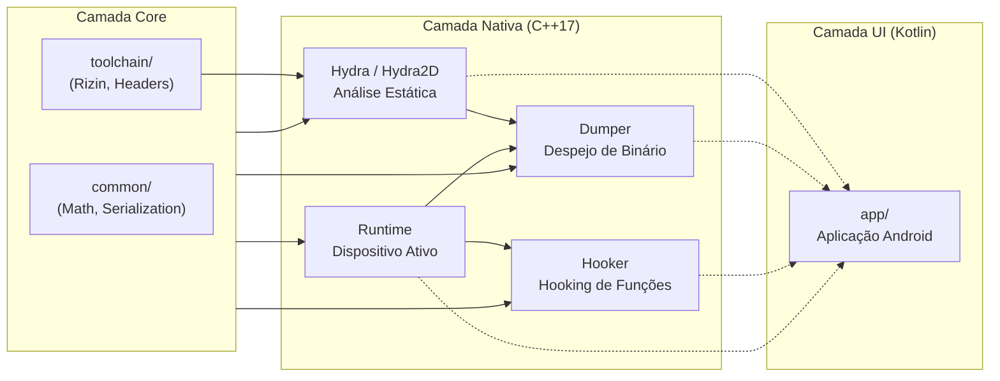

<p align="center">
  
</p>

<h1 align="center">OmniByte</h1>

<p align="center">
  <strong>Toolkit de Engenharia Reversa Android</strong><br/>
  Descompilador &bull; Editor &bull; Dumper &bull; Hooking &bull; Editor de Memória &bull; Monitor de Rede
</p>

<p align="center">
  <a href="README.md">🇮🇩 Bahasa Indonesia</a> &bull;
  <a href="README_EN.md">🇬🇧 English</a> &bull;
  <strong>🇧🇷 Portugu&ecirc;s</strong> &bull;
  <a href="README_RU.md">🇷🇺 Русский</a> &bull;
  <a href="README_ZH.md">🇨🇳 中文</a>
</p>

---

## Sobre

OmniByte é um toolkit de engenharia reversa Android construído com **Kotlin + C++ Nativo**, suportando multi-arquitetura (**ARMv7** & **ARMv8a**) e multi-versão Android (**6.0 até a versão mais recente**).

O toolkit é projetado para análise estática e dinâmica, descompilação, edição de binários, hooking de funções, edição de memória e monitoramento e edição de pacotes de rede — tudo em uma única plataforma integrada.

## Principais Funcionalidades

| Funcionalidade | Descrição |
|----------------|-----------|
| 🔍 **APK Decompiler** | Descompilar APK em código-fonte (Java/Smali/DEX) com suporte multi-engine |
| ✏️ **APK Editor** | Editar manifest, recursos, smali e reconstruir APK |
| 📊 **Análise de Binário** | Análise estática de binários (ELF/PE) com descompilador e disassembler |
| 🔧 **Editor de Binário** | Edição direta de binários com hex editor e patching |
| 📦 **Binary Dumper** | Despejar estrutura de binários manualmente ou automaticamente durante Live PID |
| 🪝 **Hooking** | Hook de funções nativas e métodos ART com 4 técnicas diferentes |
| 🧠 **Editor de Memória** | Ler e escrever na memória de processos ativos |
| 🌐 **Monitor de Pacotes de Rede** | Monitoramento de tráfego de rede em tempo real |
| 📝 **Editor de Pacotes de Rede** | Interceptar e editar pacotes de rede em tempo real |

## Suporte à Plataforma

| Componente | Suporte |
|------------|---------|
| **Android** | 6.0 (API 23) — Versão mais recente |
| **Arquitetura** | ARMv7 (32 bits), ARMv8a (64 bits) |
| **Linguagens** | Kotlin (UI), C++17 (Núcleo Nativo) |
| **Sistema de Build** | Gradle + CMake |
| **STL** | c++_shared |

## Estrutura do Projeto

```
OmniByte/
├── app/                          # Aplicação Android (Kotlin)
│   └── src/main/
│       ├── java/com/omnibyte/    # Código Kotlin
│       ├── cpp/                  # Agregador nativo (CMake)
│       └── res/                  # Recursos Android
├── Hydra/                        # Motor de Análise Estática
│   ├── Hydra2D/                  # Motor principal de análise
│   │   ├── Disassembler/         # Desmontagem de binários
│   │   ├── Decompiler/           # Descompilação de código
│   │   ├── Parser/               # Parsing de formatos de binário
│   │   ├── Orchestrator/         # Orquestração de análise
│   │   ├── Factory/              # Fábrica de componentes
│   │   ├── Plugin/               # Plugins de análise
│   │   │   ├── Enhanced/         # Plugins avançados
│   │   │   │   ├── AST/          # Árvore de Sintaxe Abstrata
│   │   │   │   ├── CFG/          # Grafo de Fluxo de Controle
│   │   │   │   ├── Crypt/        # Detecção de criptografia
│   │   │   │   ├── Deobfuscate/  # Desobfuscação
│   │   │   │   ├── Emulation/    # Emulação de binários
│   │   │   │   ├── FunctionResolver/
│   │   │   │   ├── RTTI/         # Informação de Tipo em Tempo de Execução
│   │   │   │   ├── Signatures/   # Assinaturas de padrão
│   │   │   │   └── SymbolicExecution/
│   │   │   └── ScriptHooks/      # Hooks baseados em scripts
│   │   └── docs/
│   └── Shared/                   # Metadados compartilhados
├── modules/
│   ├── Dumper/                   # Módulo Binary Dumper
│   │   ├── DumperCore/           # Lógica principal do dumper
│   │   │   ├── Detector/         # Detecção de engine
│   │   │   ├── EngineRegistry/   # Registro de engines
│   │   │   ├── ResultNormalizer/ # Normalização de saída
│   │   │   ├── SignatureBypass/  # Bypass de assinatura APK
│   │   │   ├── SharedUtils/      # Utilitários
│   │   │   └── WorkingModes/     # Modos Manual & Live
│   │   ├── Engines/              # 7 Engines de Dumper
│   │   │   ├── UnityIL2CPP/      # Unity IL2CPP
│   │   │   ├── UnityMono/        # Unity Mono
│   │   │   ├── UnrealEngine/     # Unreal Engine
│   │   │   ├── Godot/            # Godot Engine
│   │   │   ├── Cocos2d/          # Cocos2d
│   │   │   ├── GameMaker/        # GameMaker
│   │   │   └── Source2/          # Source 2
│   │   └── Export/               # Escritores de saída
│   ├── Hooker/                   # Módulo de Hooking
│   │   ├── HookEngine/           # Técnicas de hook
│   │   │   ├── ARTHook/          # Hook de métodos ART
│   │   │   ├── InlineHook/       # Hook inline de funções
│   │   │   ├── PLT_GOTHook/      # Hook PLT/GOT
│   │   │   └── TracelessHook/    # Hook anti-detecção
│   │   └── backends/             # Backends de hook
│   │       ├── Albatross/        # Backend ART hook
│   │       ├── Bhook/            # Backend PLT/GOT
│   │       ├── Inlinehook/       # Backend inline hook
│   │       ├── KittyMemory/      # Patching de memória
│   │       ├── KittyMemoryEx/    # Memória estendida
│   │       └── Vector/           # Backend traceless
│   └── HPT/                      # Módulo HPT
│       ├── Hooker/               # Wrapper de hook
│       └── MemoryEditor/         # Editor de memória
├── runtime/                      # Runtime de Dispositivo Ativo
│   ├── Bridges/                  # Carregadores de ponte
│   │   ├── FreedomServiceBridge/ # Ponte de serviço root
│   │   └── ModuleBridge/         # Ponte de módulo
│   ├── ProcessManager/           # Gerenciamento de processos
│   ├── MemoryIO/                 # Leitura/escrita de memória
│   ├── SymbolResolver/           # Resolução de símbolos (xdl)
│   ├── ZigZag/                   # Motor stealth/bypass
│   ├── ZigZagManager/            # Gerenciamento stealth
│   └── FreedomService/           # Serviço de acesso root
│       ├── KernelSU-Next/        # Suporte KernelSU
│       ├── SUI/                  # Suporte Magisk SUI
│       ├── SukiSU-Ultra/         # Suporte SukiSU
│       └── RootThread/           # Gerenciamento de thread root
├── common/                       # Utilitários compartilhados
│   ├── Math/                     # Utilitários matemáticos
│   └── Serialization/            # Serialização
├── toolchain/                    # Toolchain de build
│   ├── rizin-android/            # Desassembler Rizin
│   └── stub-headers/             # Headers stub
├── scripts/                      # Scripts de build
├── docs/                         # Documentação
└── test/                         # Fixtures de teste
```

## Pipeline de Trabalho



## Arquitetura de Módulos



## Build

```bash
# Clonar
git clone https://github.com/CicakDroid/OmniByte.git
cd OmniByte

# Build do APK
./gradlew assembleDebug

# Ou build apenas nativo
cd app/src/main/cpp
mkdir build && cd build
cmake -DCMAKE_TOOLCHAIN_FILE=$ANDROID_NDK/build/cmake/android.toolchain.cmake \
      -DANDROID_ABI=arm64-v8a \
      -DANDROID_PLATFORM=android-23 \
      ..
make
```

## Licença

Este projeto é parte da OmniByte Research Platform.

---

<p align="center">
  <sub>Feito com ❤️ por <a href="https://github.com/CicakDroid">CicakDroid</a></sub>
</p>
